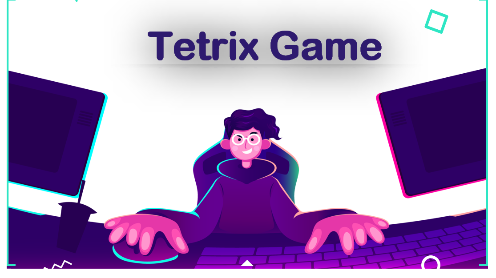

<br>
<br>



<br>


<br>


# Tetrix Game

### Create a Tetris Game application using the Qt.

<br>


* [Introduction](##Introduction)<br>

* [Why Tetris?](##Why-Tetris?)<br>

* [Prerequisites](##Prerequisites)<br>

* [The logic of the game](##The-logic-of-the-game)<br>

* [TetrixWindow Class](##TetrixWindow-Class)<br>

* [TetrixPiece Class](##TetrixPiece-Class)<br>

* [TetrixBoard Class](##-TetrixBoard-Class)<br>

* [MainWindowTetris Class](##MainWindowTetris-Class)<br>

* [Dialog](##dialog)<br>

* [conclusion](##conclusion)<br>

<br>

--------

## Intoduction


<br>


<p> Tetris is a tile-matching puzzle  game, originally designed and programmed by Russian game designer Alexey Pajitnov in 1984—the product of Alexey’s computer programming experience and his love of puzzles. 


The goal of Tetris is to score as many points as possible by clearing horizontal lines of Blocks. The player must rotate, move, and drop the falling Tetriminos (Tetriminos are game pieces shaped like tetrominoes, geometric shapes composed of four square blocks each) inside the Matrix (playing field). Lines are cleared when they are filled with Blocks and have no empty spaces.  If the Blocks land above the top of the playing field, the game is over.</p>
<br>

--------

## Why Tetris?


<br>


<br>

<p>
Tetris is the best choice for getting started in video game programming. It includes everything a game requires, the main loop, event management, collision management, score management, we can even go further with sound management. It doesn't require incredible graphic skills, anyone who knows how to draw a square block with image processing software can manage to make a drinkable version of Tetris. And with a little effort, our version of Tetris can complete with current commercial versions.
</p>

<br>

--------

## Prerequisites

<p>

The basics of C++ (classes, actions, methods, references and pointers) will be necessary for you to follow this article. For graphic rendering, the Qt Designer will be used

<br>

Before we start, just to whet our appetites, here's what our game will look like once we've got through the whole article:
</p>

<br>


<br>


<br>

>Alright, let's do it !

<br>

--------

## The logic of the game 

<p>
One of the difficulties of programming a Tetris is knowing how to represent the game pieces and how to manage their rotations. The game has 7 of them, each made up of 4 blocks:
</p>

<br>


<br>

<p>These pieces are called according to the cursor :
 Left cursor key moves the current piece one space to the left, the Right cursor key moves it one space to the right, the Up cursor key rotates the piece counter-clockwise by 90 degrees, and the Down cursor key rotates the piece clockwise by 90 degrees.

To avoid waiting for a piece to fall to the bottom of the board, we press D to immediately move the piece down by one row, or we press the Space key to drop it as close to the bottom of the board as possible.
</p>

<br>

So to make this game , we will create a project on Qt called  **Tetris**  which contains three main classes :
<br>

* **The TetrixWindow class:** is used to display the player's score, number of lives, and information about the next piece to appear.
* **The TetrixBoard class:** contains the game logic, handles keyboard input, and displays the pieces on the playing area.
* **The TetrixPiece class:** contains information about each piece. 

 <br>

 --------------
 
 ## TetrixWindow Class


<br>

The TetrixWindow class is used to display the game information and contains the following components :
  <br>

This class contains this following components :

* **three QLCDNumber :** to display the score,level and lines.
* **three QPushButton :** is used for displaying next piece.
* **QDial :** It looks like a volume control you often see on mix panels , it's used to control the level on sound.

<br>

>NB : the interpretation of each part of the code is found in the code itself in the form of a comment.

-----------
## tetrixwindow.h 

<br>

```JavaScript
#include "precompiledHeader.h"

class QLCDNumber;
class QLabel;
class QPushButton;

class TetrixBoard;

class TetrixWindow : public QWidget
{
    Q_OBJECT

public:
    TetrixWindow();

private:
    //We use private member variables for the board, various display widgets, and buttons 
    //to allow the user to start a new game, pause the current game, and quit
  
    QLabel *createLabel(const QString &text);

    TetrixBoard *board;
    QLabel *nextPieceLabel;
    QLCDNumber *scoreLcd;
    QLCDNumber *levelLcd;
    QLCDNumber *linesLcd;
    QPushButton *startButton;
    QPushButton *quitButton;
    QPushButton *pauseButton;
    QDial *volumeDial;
};
```
<br>

>Although the window inherits QWidget, the constructor does not provide an argument to allow a parent widget to be specified. This is because the window will always be used as a top-level widget.
<br>

-----------
## tetrixwindow.cpp

The constructor sets up the user interface elements for the game:
<br>

```JavaScript

#include "tetrixboard.h"
#include "tetrixwindow.h"


TetrixWindow::TetrixWindow()
{
    // set up the user interface elements for the game
    board = new TetrixBoard;

    nextPieceLabel = new QLabel;
    nextPieceLabel->setFrameStyle(QFrame::Box | QFrame::Raised);
    nextPieceLabel->setAlignment(Qt::AlignCenter);
    nextPieceLabel->setStyleSheet("background-color:moccasin;");
    board->setNextPieceLabel(nextPieceLabel);
    board->setStyleSheet("background-image: url(:/picture/canva.jfif);");
    
    //Three QLCDNumber objects are used to display the score,number 
    //of lives, and lines removed. These initially show default values
    
    scoreLcd = new QLCDNumber(2);
    scoreLcd->setSegmentStyle(QLCDNumber::Outline);
    scoreLcd->setStyleSheet("background-color: black");
    levelLcd = new QLCDNumber(2);
    levelLcd->setSegmentStyle(QLCDNumber::Outline);
    levelLcd->setStyleSheet("background-color: black");
    linesLcd = new QLCDNumber(2);
    linesLcd->setSegmentStyle(QLCDNumber::Outline);
    linesLcd->setStyleSheet("background-color: black");
    
    //Three buttons with shortcuts are constructed so that the user can 
    //start a new game, pause the current game, and quit the application:
    
    //These buttons are configured so that they never receive the keyboard 
    //focus; we want the keyboard focus to remain with the TetrixBoard
    //instance so that it receives all the keyboard events.
    
    startButton = new QPushButton(tr("&Start"));
    startButton->setStyleSheet("background-color:rgb(255, 85, 127);");
    startButton->setFocusPolicy(Qt::NoFocus);
    quitButton = new QPushButton(tr("&Quit"));
    quitButton->setFocusPolicy(Qt::NoFocus);
    quitButton->setStyleSheet("background-color:moccasin;");
    pauseButton = new QPushButton(tr("&Pause"));
    pauseButton->setFocusPolicy(Qt::NoFocus);
    pauseButton->setStyleSheet("background-color:moccasin;");
    
    //to control the volume or level of sound, so we set the max and the min 
    //value and also we add the stylesheet and policy ..
    
    volumeDial = new QDial();
    volumeDial->setStyleSheet("background-color:moccasin;");
    volumeDial->setFocusPolicy(Qt::StrongFocus);
    volumeDial->setNotchesVisible(true);
    volumeDial->setMaximum(100);
    volumeDial->setMinimum(0);
    volumeDial->setValue(50);
    volumeDial->setStyleSheet("QDial{ background-color: moccasin;"
                              "QLinearGradient(spread:pad, x1:0.683, y1:1, x2:1, y2:0,"
                              " stop:0 rgba(103, 103, 103,255), stop:1 rgba(144, 144, 144, 255)); }");

    //We connect clicked() signals from the Start and Pause buttons to the board, 
    //and from the Quit button to the application's  QCoreApplication::quit() slot.
    connect(startButton, &QPushButton::clicked, board, &TetrixBoard::start);
    connect(quitButton , &QPushButton::clicked, qApp, &QApplication::quit);
    connect(pauseButton, &QPushButton::clicked, board, &TetrixBoard::pause);
    //we connect the signal value changed () from the volume dial to the board by the slot set volume () 
    connect(volumeDial, SIGNAL(valueChanged(int)),board, SLOT(setVolume(int))); //lazy

//Signals from the board are also connected to the LCD widgets for the purpose 
//of updating the score,number of lives, and lines removed from the playing area.
#if __cplusplus >= 201402L
    connect(board, &TetrixBoard::scoreChanged,
            scoreLcd, qOverload<int>(&QLCDNumber::display));
    connect(board, &TetrixBoard::levelChanged,
            levelLcd, qOverload<int>(&QLCDNumber::display));
    connect(board, &TetrixBoard::linesRemovedChanged,
            linesLcd, qOverload<int>(&QLCDNumber::display));
#else
    connect(board, &TetrixBoard::scoreChanged,
            scoreLcd, QOverload<int>::of(&QLCDNumber::display));
    connect(board, &TetrixBoard::levelChanged,
            levelLcd, QOverload<int>::of(&QLCDNumber::display));
    connect(board, &TetrixBoard::linesRemovedChanged,
            linesLcd, QOverload<int>::of(&QLCDNumber::display));
#endif

    //We place the label, LCD widgets, and the board into a QGridLayout along with 
    //some labels that we create with the createLabel() convenience function:
    QGridLayout *layout = new QGridLayout;
    layout->addWidget(board, 0, 0, 15, 8);
	layout->addWidget(createLabel(tr("NEXT")), 0, 9);
	layout->addWidget(nextPieceLabel, 1, 9);
	layout->addWidget(createLabel(tr("LEVEL")), 2, 9);
	layout->addWidget(levelLcd, 3, 9);
    layout->addWidget(createLabel(tr("SCORE")), 4, 9);
    layout->addWidget(scoreLcd, 5, 9);
    layout->addWidget(createLabel(tr("LINES REMOVED")), 6, 9);
    layout->addWidget(linesLcd, 7, 9);
	layout->addWidget(createLabel(tr("    ")), 8, 9);
    layout->addWidget(quitButton, 9, 9);
    layout->addWidget(pauseButton, 10, 9);
	layout->addWidget(startButton, 11, 9);
    layout->addWidget(volumeDial, 14, 9);
    //Finally, we set the grid layout on the widget
    setLayout(layout);
}


// this function simply creates a new label on the heap
QLabel *TetrixWindow::createLabel(const QString &text)
{
    QLabel *label = new QLabel(text);
    //gives it an appropriate alignment, and returns it to the caller:
    label->setAlignment(Qt::AlignHCenter | Qt::AlignBottom);
    return label;
}

```
<br>

-----------
## TetrixPiece Class

<br>

The TetrixPiece class holds information about a piece in the game's playing area,including its shape, position, and the range of positions it can occupy on the board:
<br>

-----------
## tetrixpiece.h

<br>

```javascript
enum TetrixShape { NoShape, ZShape, SShape, LineShape, TShape, SquareShape,
                   LShape, MirroredLShape };

class TetrixPiece
{
public:
    TetrixPiece() { setShape(NoShape); }

    void setRandomShape();
    void setShape(TetrixShape shape);

    TetrixShape shape() const { return pieceShape; }

    /* Les coordonnées du point de pivot de la pièce */
    int x(int index) const { return coords[index][0]; }
    int y(int index) const { return coords[index][1]; }
    int minX() const;
    int maxX() const;
    int minY() const;
    int maxY() const;
    TetrixPiece rotatedLeft() const;
    TetrixPiece rotatedRight() const;

private:
    void setX(int index, int x) { coords[index][0] = x; }
    void setY(int index, int y) { coords[index][1] = y; }

    TetrixShape pieceShape;
    int coords[4][2];
};
```

<p>Each shape contains four blocks, and these are defined by the coords private member variable. Additionally, each piece has a high-level description that is stored internally in the pieceShape variable.
<br>

The constructor is written inline in the definition, and simply ensures that each piece is initially created with no shape. The shape() function simply returns the contents of the pieceShape variable, and the x() and y() functions return the x and y-coordinates of any given block in the shape.</p>

<br>

-----------
## tetrixpiece.cpp

<br>

```javascript
#include "precompiledHeader.h"
#include "tetrixpiece.h"

void TetrixPiece::setRandomShape()
{
    //Tthis function is used to select a random shape for a piece:
    setShape(TetrixShape(QRandomGenerator::global()->bounded(7) + 1));
}

void TetrixPiece::setShape(TetrixShape shape)
{
     //this function uses a look-up table of pieces to associate 
     //each shape with an array of block positions:
    static const int coordsTable[8][4][2] = {
        { { 0, 0 },   { 0, 0 },   { 0, 0 },   { 0, 0 } },
        { { 0, -1 },  { 0, 0 },   { -1, 0 },  { -1, 1 } },
        { { 0, -1 },  { 0, 0 },   { 1, 0 },   { 1, 1 } },
        { { 0, -1 },  { 0, 0 },   { 0, 1 },   { 0, 2 } },
        { { -1, 0 },  { 0, 0 },   { 1, 0 },   { 0, 1 } },
        { { 0, 0 },   { 1, 0 },   { 0, 1 },   { 1, 1 } },
        { { -1, -1 }, { 0, -1 },  { 0, 0 },   { 0, 1 } },
        { { 1, -1 },  { 0, -1 },  { 0, 0 },   { 0, 1 } }
    };

    //These positions are read from the table into the piece's own array of positions, 
    //and the piece's internal shape information is updated to use the new shape

    for (int i = 0; i < 4 ; i++) {
        for (int j = 0; j < 2; ++j)
            coords[i][j] = coordsTable[shape][i][j];
    }
    pieceShape = shape;
}

 //The x() and y() functions are implemented inline in the class definition, returning positions 
 //defined on a grid that extends horizontally and vertically with coordinates from -2 to 2. Although
 //the predefined coordinates for each piece only vary horizontally from -1 to 1 and vertically 
 //from -1 to 2, each piece can be rotated by 90, 180, and 270 degrees.The minX() and maxX() functions
 //return the minimum and maximum horizontal coordinates occupied by the blocks that make up the piece:
 
int TetrixPiece::minX() const
{
    int min = coords[0][0];
    for (int i = 1; i < 4; ++i)
        min = qMin(min, coords[i][0]);
    return min;
}

int TetrixPiece::maxX() const
{
    int max = coords[0][0];
    for (int i = 1; i < 4; ++i)
        max = qMax(max, coords[i][0]);
    return max;
}


//Similarly, the minY() and maxY() functions return the minimum and 
//maximum vertical coordinates occupied by the blocks:
int TetrixPiece::minY() const
{
    int min = coords[0][1];
    for (int i = 1; i < 4; ++i)
        min = qMin(min, coords[i][1]);
    return min;
}

int TetrixPiece::maxY() const
{
    int max = coords[0][1];
    for (int i = 1; i < 4; ++i)
        max = qMax(max, coords[i][1]);
    return max;
}

//The rotatedLeft() function returns a new piece with the same shape 
//as an existing piece, but rotated counter-clockwise by 90 degrees:

TetrixPiece TetrixPiece::rotatedLeft() const
{
    if (pieceShape == SquareShape)
        return *this;

    TetrixPiece result;
    result.pieceShape = pieceShape;
    for (int i = 0; i < 4; ++i) {
        result.setX(i, y(i));
        result.setY(i, -x(i));
    }
    return result;
}

//Similarly, the rotatedRight() function returns a new piece with the same
//shape as an existing piece, but rotated clockwise by 90 degrees:

TetrixPiece TetrixPiece::rotatedRight() const
{
    if (pieceShape == SquareShape)
        return *this;

    TetrixPiece result;
    result.pieceShape = pieceShape;
    for (int i = 0; i < 4; ++i) {
        result.setX(i, -y(i));
        result.setY(i, x(i));
    }
    return result;
}

```

>These last two functions enable each piece to create rotated copies of itself

<br>

-----------
## TetrixBoard Class

<br>

The TetrixBoard class is the longer and the complex class as it contains several functions .This clas inherits from QFrame and contains the game logic and display features:

<br>

-----------
## TetrixBoard.h

```javascript
#include "precompiledHeader.h"
#include "tetrixpiece.h"

class QLabel;

class TetrixBoard : public QFrame
{
    Q_OBJECT

public:
    TetrixBoard(QWidget *parent = 0);

    //Apart from the setNextPieceLabel() function and the start() and pause() public slots, 
    //we only provide public functions to reimplement QWidget::sizeHint() and QWidget::minimumSizeHint().
    //The signals are used to communicate changes to the player's information to the TetrixWindow instance.
    void setNextPieceLabel(QLabel *label);
    QSize sizeHint() const override;
    QSize minimumSizeHint() const override;

public slots:
    void start();
    void pause();
    void setVolume(int volume);

signals:
    void scoreChanged(int score);
    void levelChanged(int level);
    void linesRemovedChanged(int numLines);

protected:
    void paintEvent(QPaintEvent *event) override;
    void keyPressEvent(QKeyEvent *event) override;
    void timerEvent(QTimerEvent *event) override;

private:
    enum { BoardWidth = 10, BoardHeight = 22 };


    //The rest of the functionality is provided by reimplementations of protected
    //event handlers and private functions
    TetrixShape &shapeAt(int x, int y) { return board[(y * BoardWidth) + x]; }
    int timeoutTime() { return 1000 / (1 + level); }
    int squareWidth() { return contentsRect().width() / BoardWidth; }
    int squareHeight() { return contentsRect().height() / BoardHeight; }
    void clearBoard();
    void dropDown();
    void oneLineDown();
    void pieceDropped(int dropHeight);
    void removeFullLines();
    void newPiece();
    void showNextPiece();
    bool tryMove(const TetrixPiece &newPiece, int newX, int newY);
    void drawSquare(QPainter &painter, int x, int y, TetrixShape shape);

    QBasicTimer timer;
    QPointer<QLabel> nextPieceLabel;
    bool isStarted;
    bool isPaused;
    bool isWaitingAfterLine;
    TetrixPiece curPiece;
    TetrixPiece nextPiece;
    int curX;
    int curY;
    int numLinesRemoved;
    int numPiecesDropped;
    int score;
    int level;
    int volume;
    //The board is composed of a fixed-size array whose elements correspond to spaces for
    //individual blocks.Each element in the array contains a TetrixShape value corresponding
    //to the type of shape that occupies that element.
    TetrixShape board[BoardWidth * BoardHeight];
    //we add QMediaPlayer to playback songs,
    QMediaPlayer player;
    QMediaPlayer pieceSound;
};
```
>Each shape on the board will occupy four elements in the array, and these will all contain the enum value that corresponds to the type of the shape.

<br>

-----------
## TetrixBoard.cpp

<br>

Here we have really a lot of functions to implement , that's why we explained each function and its role on the code.
<br>

So,in the constructor, we customize the frame style of the widget, ensure that keyboard input will be received by the widget by using Qt::StrongFocus for the focus policy, and initialize the game state:

```javascript
#include "precompiledHeader.h"
#include "tetrixboard.h"

TetrixBoard::TetrixBoard(QWidget *parent)
    : QFrame(parent)
{
    setFrameStyle(QFrame::Panel | QFrame::Sunken);
    setFocusPolicy(Qt::StrongFocus);
    isStarted = false;
    isPaused = false;
    clearBoard();
    //set the path of the media
    player.setMedia(QUrl("qrc:/sound/Tetris.mp3"));
    //set the volume
    player.setVolume(volume);

    //The first (next) piece is also set up with a random shape
    nextPiece.setRandomShape();
}

//The setNextPieceLabel() function is used to pass in an externally-constructed 
//label to the board, so that it can be shown alongside the playing area
void TetrixBoard::setNextPieceLabel(QLabel *label)
{
    nextPieceLabel = label;
}

//We provide a reasonable size hint and minimum size hint for the board, 
//based on the size of the space for each block in the playing area:
QSize TetrixBoard::sizeHint() const
{
    return QSize(BoardWidth * 15 + frameWidth() * 2,
                 BoardHeight * 15 + frameWidth() * 2);
}
//By using a minimum size hint, we indicate to the layout in the parent 
//widget that the board should not shrink below a minimum size.
QSize TetrixBoard::minimumSizeHint() const
{
    return QSize(BoardWidth * 5 + frameWidth() * 2,
                 BoardHeight * 5 + frameWidth() * 2);
}

//A new game is started when the start() slot is called. This resets the game's 
//state, the player's score and level, and the contents of the board:
void TetrixBoard::start()
{
    if (isPaused)
        return;

    player.play();
    isStarted = true;
    isWaitingAfterLine = false;
    numLinesRemoved = 0;
    numPiecesDropped = 0;
    score = 0;
    level = 1;
    volume = 50;
    clearBoard();

    emit linesRemovedChanged(numLinesRemoved);
    emit scoreChanged(score);
    emit levelChanged(level);
    player.setVolume(volume);
    pieceSound.setVolume(volume);

    newPiece();
    //We also emit signals to inform other components of these changes before creating a 
    //new piece that is ready to be dropped into the playing area. We start the timer that 
    //determines how often the piece drops down one row on the board
    timer.start(timeoutTime(), this);
}


//The pause() slot is used to temporarily stop the current game by stopping the internal timer
void TetrixBoard::pause()
{

    //We perform checks to ensure that the game can only be paused 
    //if it is already running and not already paused.
    if (!isStarted)
        return;

    isPaused = !isPaused;
    if (isPaused) {
        timer.stop();
        player.pause();
    } else {
        timer.start(timeoutTime(), this);
        player.play();
    }
    update();
}

//the setVolume(int volume) function used to control the sound
void TetrixBoard::setVolume(int volume)
{
    if(volume == 0)
    {
        player.setMuted(true);
        pieceSound.setMuted(true);
    }
    else{
        player.setMuted(false);
        player.setVolume(volume);
        pieceSound.setMuted(false);
        pieceSound.setVolume(volume);
    }
}

//The paintEvent() function is straightforward to implement. We begin by calling the base 
//class's implementation of paintEvent() before constructing a QPainter for use on the board

void TetrixBoard::paintEvent(QPaintEvent *event)
{
    QFrame::paintEvent(event);
    QPainter painter(this);
    QRect rect = contentsRect(); //Since the board is a subclass of QFrame, 
    //we obtain a QRect that covers the area inside
    //the frame decoration before drawing our own content.


    //If the game is paused, we want to hide the existing state of the board and show some text. 
    //We achieve this by painting text onto the widget and returning early from the function. 
    //The rest of the painting is performed after this point.
    
    if (isPaused) {
        painter.setPen ( Qt::white );
        painter.drawText(rect, Qt::AlignCenter, tr("Pause"));
        return;
    }

    //The position of the top of the board is found by subtracting the total height of each 
    //space on the board from the bottom of the frame's internal rectangle. For each space on 
    //the board that is occupied by a piece, we call the drawSquare() function to draw a block at that position
    
    int boardTop = rect.bottom() - BoardHeight*squareHeight();

    for (int i = 0; i < BoardHeight; ++i) {
        for (int j = 0; j < BoardWidth; ++j) {
            TetrixShape shape = shapeAt(j, BoardHeight - i - 1);
            if (shape != NoShape)
                drawSquare(painter, rect.left() + j * squareWidth(),
                           boardTop + i * squareHeight(), shape);
        }
    }

    //Unlike the existing pieces on the board, the current piece is drawn block-by-block at its current position:
    if (curPiece.shape() != NoShape) {
        for (int i = 0; i < 4; ++i) {
            int x = curX + curPiece.x(i);
            int y = curY - curPiece.y(i);
            drawSquare(painter, rect.left() + x * squareWidth(),
                       boardTop + (BoardHeight - y - 1) * squareHeight(),
                       curPiece.shape());
        }
    }
    if(player.state()== QMediaPlayer::StoppedState)
    {
        player.play();
    }
}

//The keyPressEvent() handler is called whenever the player presses a key while
//the TetrixBoard widget has the keyboard focus.

void TetrixBoard::keyPressEvent(QKeyEvent *event)
{
    if (!isStarted || isPaused || curPiece.shape() == NoShape) {
        QFrame::keyPressEvent(event);
        return;

        //=>If there is no current game, the game is running but paused, or if there is no current 
        //shape to control, we simply pass on the event to the base class.
    }

    //We check whether the event is about any of the keys that the player uses to control the 
    //current piece and, if so, we call the relevant function to handle the input:
    
    switch (event->key()) {
    case Qt::Key_Left:
        tryMove(curPiece, curX - 1, curY);
        break;
    case Qt::Key_Right:
        tryMove(curPiece, curX + 1, curY);
        break;
    case Qt::Key_Down:
        tryMove(curPiece.rotatedRight(), curX, curY);
        break;
    case Qt::Key_Up:
        tryMove(curPiece.rotatedLeft(), curX, curY);
        break;
    case Qt::Key_Space:
        dropDown();
        break;
    case Qt::Key_D:
        oneLineDown();
        break;
    default:
        QFrame::keyPressEvent(event);//In the case where the player presses a key that we are not interested in, 
        //we again pass on the event to the base class's implementation of keyPressEvent().
    }
}

//The timerEvent() handler is called every time the class's QBasicTimer instance times out. 
//We need to check that the event we receive corresponds to our timer. 
//If it does, we can update the board:

void TetrixBoard::timerEvent(QTimerEvent *event)
{
    if (event->timerId() == timer.timerId()) {
        if (isWaitingAfterLine) {
            isWaitingAfterLine = false;
            newPiece();
            timer.start(timeoutTime(), this);
        } else {
            oneLineDown();
        }
    } else {
        QFrame::timerEvent(event);
    }
    //=>If a row (or line) has just been filled, we create a new piece and reset the timer; 
    //otherwise we move the current piece down by one row. We let the base class handle other timer events that we receive.
}
//The clearBoard() function simply fills the board with the TetrixShape::NoShape value:
void TetrixBoard::clearBoard()
{
    for (int i = 0; i < BoardHeight * BoardWidth; ++i)
        board[i] = NoShape;
}

//The dropDown() function moves the current piece down as far as possible on the board,
//either until it is touching the bottom of the playing area or it is stacked on top of another piece:

void TetrixBoard::dropDown()
{
    int dropHeight = 0;
    int newY = curY;
    while (newY > 0) {
        if (!tryMove(curPiece, curX, newY - 1))
            break;
        --newY;
        ++dropHeight;
    }
    pieceDropped(dropHeight);

    //=>The number of rows the piece has dropped is recorded and passed to 
    //the pieceDropped() function so that the player's score can be updated.
}

//The oneLineDown() function is used to move the current piece down by one row (line),
//either when the user presses the D key or when the piece is scheduled to move

void TetrixBoard::oneLineDown()
{
    if (!tryMove(curPiece, curX, curY - 1))
        pieceDropped(0);
	
    //=>If the piece cannot drop down by one line, we call the pieceDropped() function with zero 
    //as the argument to indicate that it cannot fall any further, and that the player should
    //receive no extra points for the fall.
}

//The pieceDropped() function itself is responsible for awarding points to the player for 
//positioning the current piece, checking for full rows on the board and, if no lines have
//been removed, creating a new piece to replace the current one:

void TetrixBoard::pieceDropped(int dropHeight)
{
    for (int i = 0; i < 4; ++i) {
        int x = curX + curPiece.x(i);
        int y = curY - curPiece.y(i);
        shapeAt(x, y) = curPiece.shape();
    }
    pieceSound.setMedia(QUrl("qrc:/sound/drop.wav"));
    pieceSound.play();
    ++numPiecesDropped;
    if (numPiecesDropped % 25 == 0) {
        ++level;
        timer.start(timeoutTime(), this);
        emit levelChanged(level);
    }

    score += dropHeight + 7;
    emit scoreChanged(score);
    removeFullLines();

    if (!isWaitingAfterLine)
        newPiece();
}

//We call removeFullLines() each time a piece has been dropped. This scans the board 
//from bottom to top, looking for blank spaces on each row.

void TetrixBoard::removeFullLines()
{
    int numFullLines = 0;

    for (int i = BoardHeight - 1; i >= 0; --i) {
        bool lineIsFull = true;

        for (int j = 0; j < BoardWidth; ++j) {
            if (shapeAt(j, i) == NoShape) {
                lineIsFull = false;
                break;
            }
        }

        //If a row contains no blank spaces, the rows above it are copied down by one row to
        //compress the stack of pieces, the top row on the board is cleared, and the number of 
        //full lines found is incremented.
	
        if (lineIsFull) {
            ++numFullLines;
            pieceSound.setMedia(QUrl("qrc:/sound/money.wav"));
            pieceSound.play();
            for (int k = i; k < BoardHeight - 1; ++k) {
                for (int j = 0; j < BoardWidth; ++j)
                    shapeAt(j, k) = shapeAt(j, k + 1);
            }
            for (int j = 0; j < BoardWidth; ++j)
                shapeAt(j, BoardHeight - 1) = NoShape;
        }
    }

    if (numFullLines > 0) {
        numLinesRemoved += numFullLines;
        score += 10 * numFullLines;
        emit linesRemovedChanged(numLinesRemoved);
        emit scoreChanged(score);

        timer.start(500, this);
        isWaitingAfterLine = true;
        curPiece.setShape(NoShape);
        update();
	
    } //=>If some lines have been removed, the player's score and the total number
    //of lines removed are updated. The linesRemoved() and scoreChanged() signals are emitted
    //to send these new values to other widgets in the window.
}

//The newPiece() function places the next available piece at the top of the board, and creates
//a new piece with a random shape:

void TetrixBoard::newPiece()
{
    curPiece = nextPiece;
    nextPiece.setRandomShape();
    showNextPiece();
    curX = BoardWidth / 2 + 1;
    curY = BoardHeight - 1 + curPiece.minY();

    if (!tryMove(curPiece, curX, curY)) {
        curPiece.setShape(NoShape);
        timer.stop();
        isStarted = false;
	
    } //=>We place a new piece in the middle of the board at the top. 
    //The game is over if the piece can't move, so we unset its shape 
    //to prevent it from being drawn, stop the timer, and unset the isStarted flag.
}

//The showNextPiece() function updates the label that shows the next piece to be dropped:
void TetrixBoard::showNextPiece()
{
    if (!nextPieceLabel)
        return;

    int dx = nextPiece.maxX() - nextPiece.minX() + 1;
    int dy = nextPiece.maxY() - nextPiece.minY() + 1;

    QPixmap pixmap(dx * squareWidth(), dy * squareHeight());
    QPainter painter(&pixmap);
    painter.fillRect(pixmap.rect(), nextPieceLabel->palette().background());

    for (int i = 0; i < 4; ++i) {
        int x = nextPiece.x(i) - nextPiece.minX();
        int y = nextPiece.y(i) - nextPiece.minY();
        drawSquare(painter, x * squareWidth(), y * squareHeight(),
                   nextPiece.shape());
    }
    nextPieceLabel->setPixmap(pixmap);
} //=>We draw the piece's component blocks onto a pixmap that is then set on the label.


//The tryMove() function is used to determine whether a piece can be positioned at the specified coordinates:
bool TetrixBoard::tryMove(const TetrixPiece &newPiece, int newX, int newY)
{
    for (int i = 0; i < 4; ++i) {
        int x = newX + newPiece.x(i);
        int y = newY - newPiece.y(i);
        if (x < 0 || x >= BoardWidth || y < 0 || y >= BoardHeight)
            return false;
        if (shapeAt(x, y) != NoShape)
            return false;
    }

    //We examine the spaces on the board that the piece needs to occupy and,
    //if they are already occupied by other pieces, we return false to indicate that the move has failed.
    
    curPiece = newPiece;
    curX = newX;
    curY = newY;
    update();
    return true;
    //=>If the piece could be placed on the board at the desired location,
    //we update the current piece and its position, update the widget, 
    //and return true to indicate success.
}


//The drawSquare() function draws the blocks (normally squares) that make up
//each piece using different colors for pieces with different shapes

void TetrixBoard::drawSquare(QPainter &painter, int x, int y, TetrixShape shape)
{
    static const QRgb colorTable[8] = {
        0x000000, 0xCC6666, 0x66CC66, 0x6666CC,
        0xCCCC66, 0xCC66CC, 0x66CCCC, 0xDAAA00
    };

    QColor color = colorTable[int(shape)];
    painter.fillRect(x + 1, y + 1, squareWidth() - 2, squareHeight() - 2,
                     color);

    painter.setPen(color.light());
    painter.drawLine(x, y + squareHeight() - 1, x, y);
    painter.drawLine(x, y, x + squareWidth() - 1, y);

    painter.setPen(color.dark());
    painter.drawLine(x + 1, y + squareHeight() - 1,
                     x + squareWidth() - 1, y + squareHeight() - 1);
    painter.drawLine(x + squareWidth() - 1, y + squareHeight() - 1,
                     x + squareWidth() - 1, y + 1);

    //=>We obtain the color to use from a look-up table that relates each shape to an RGB value,
    //and use the painter provided to draw the block at the specified coordinates
}

```

<br>

>Now , we are created the main classes of our game .That's great .But we have to complete our game by adding another classe named 'mainwindowtetris' in order to add some settings and slots on our main window  manually .

<br>

-----------
## MainWindowTetris class

<br>

Inthis part , we will create a class called **MainWindowTetris**  that inherits from QMainWindow and implements this first function and the two others slots :
<p>

*  **createMenuBar()** 
  * **commande()**
  * **about()**

</p>
<br>

----------
## MainWindowTetris.h

<br>
we declare our functions:
<br>

```javascript
#include "precompiledHeader.h"

namespace Ui {
class MainWindowTetris;
}

class MainWindowTetris : public QMainWindow
{
    Q_OBJECT

public:
    explicit MainWindowTetris(QWidget *parent = nullptr);
    ~MainWindowTetris();

private:
    Ui::MainWindowTetris *ui;
    void createMenuBar();

private slots:
    void commande();
    void about();
};

```
<br>

----------
## MainWindowTetris.cpp

<br>

```javascript
#include "precompiledHeader.h"
#include "mainWindowTetris.h"
#include "ui_mainWindowTetris.h"
#include "tetrixwindow.h"

MainWindowTetris::MainWindowTetris(QWidget *parent) :
    QMainWindow(parent),
    ui(new Ui::MainWindowTetris)
{
    ui->setupUi(this);
	TetrixWindow *window = new TetrixWindow;
	QHBoxLayout *layout = new QHBoxLayout;
    //set layout
	layout->addWidget(window);
	setCentralWidget(new QWidget);
	centralWidget()->setLayout(layout);
    setFixedSize(500, 670);
    //set the title
	this->setWindowTitle("Qt Tetris");
    //set the icon of our appl
    this->setWindowIcon(QIcon(":/picture/tetris.png"));
    createMenuBar();
}


void MainWindowTetris::createMenuBar()
{
    QMenu *helpMenu = menuBar()->addMenu(tr("&Help"));
    QAction *aboutAct = helpMenu->addAction(tr("&commande"), this, &MainWindowTetris::commande);
    aboutAct = helpMenu->addAction(tr("&About"), this, &MainWindowTetris::about);
    aboutAct->setStatusTip(tr("Show the application's About box"));
}


void MainWindowTetris::commande()
{
   QMessageBox::about(this, tr("commande Game"),
            tr("<br><b>key → :</b>  move left \n</br>"
               "<br><b>key ← :</b>  move right \n</br>"
               "<br><b>key ↓ :</b>  rotate right \n</br>"
               "<br><b>key ↑ :</b>  rotate left \n</br>"
               "<br><b>key space :</b>  drop down \n</br>"
               "<br><b>key D :</b>  drop one line down</br>"));
}

void MainWindowTetris::about()
{
   QMessageBox::about(this, tr("About Application"),
            tr("The <b>Application</b> example demonstrates how to "
               "write Tetris game using Qt "
               " (Have fun chaima lgdour)."));
}


MainWindowTetris::~MainWindowTetris()
{
    delete ui;
}
```
>Now we are almost finished our application , one more step that we have to add is the creation of the first interface that we have set on the top of this article .

<br>

----------
## Dialog

<br>

Now we need the first interface of our application  , so that's why we  create a class  called  **dialog**  who inherits from QDialog with an interface **dialog.ui**  to set the components of our interface  using QDesigner:

<br>

-----------
## dialog.h 

<br>


```JavaScript
#include "mainWindowTetris.h"
#include "ui_mainWindowTetris.h"

#include <QDialog>

namespace Ui {
class Dialog;
}

class Dialog : public QDialog
{
    Q_OBJECT

public:
    explicit Dialog(QWidget *parent = nullptr);
    ~Dialog();

private slots:
    void on_pushButton_clicked();

private:
    Ui::Dialog *ui;
    MainWindowTetris *w;

};

```

--------
## dialog.cpp

<br>

```javascript
#include "dialog.h"
#include "ui_dialog.h"
#include "mainWindowTetris.h"
#include "ui_mainWindowTetris.h"
Dialog::Dialog(QWidget *parent) :
    QDialog(parent),
    ui(new Ui::Dialog)
{
    ui->setupUi(this);
}

Dialog::~Dialog()
{
    delete ui;
}

void Dialog::on_pushButton_clicked()
{
 w = new MainWindowTetris(this);
 w->show();

}

```
<br>

-----------
## dialog.ui

<br>


<br>

>finally, we are finished our application . <br> Now, I will leave you with a quick gif to see how our application looks like and how it works :

<br>


------------------

<br>

------------------

## Conclusion

<p>

Although this project is a little bit complex , but it gives us an idea of how it is important to write GUI applications using Qt as this creator considered as a complete integrated development envirenment (IDE) for creating applications with the Qt application framework.
</p>


